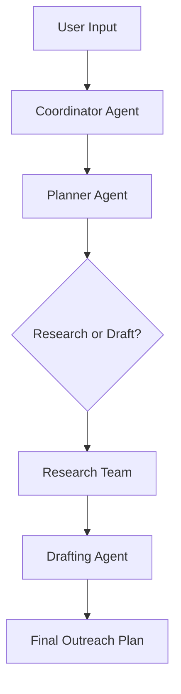

# 👻 Unghost Agent

<div align="center">
  
  <h1>Unghost Agent</h1>
  <h3>Transform Cold Outreach From Ghosted to Irresistible</h3>
</div>

<p align="center">
  <a href="#-quick-start"><strong>Quick Start</strong></a> ·
  <a href="#-architecture"><strong>Architecture</strong></a> ·
  <a href="#-acknowledgements"><strong>Acknowledgements</strong></a>
</p>

<p align="center">
  <a href="https://www.python.org/downloads/release/python-3120/"></a>
  <a href="https://github.com/storyarcade/unghost/blob/master/LICENSE"></a>
  <a href="https://github.com/langchain-ai/langgraph"></a>
</p>

[English](./README.md) | [简体中文](./README_zh.md) | [Español](./README_es.md)

---

**Unghost Agent** is a community-driven, open-source AI framework designed to revolutionize personalized outreach. It combines advanced language models with specialized tools for deep prospect research, persona analysis, and strategic message crafting. Say goodbye to generic templates and hello to high-converting conversations.

## ✨ Acknowledgements & Inspiration

This project stands on the shoulders of giants.

- **Kudos to DeerFlow**: Unghost Agent is a refactored and specialized version of the incredible [DeerFlow](https://github.com/bytedance/deer-flow) framework. We are immensely grateful to the original contributors for their foundational work.
- 💡 **Inspiration**: The vision for Unghost Agent was sparked by [Bhavye Khetan's insight](https://x.com/bhavye_khetan/status/1929379775602373012) on AI's potential for personalized outreach and [Roy Lee's demonstration](https://x.com/im_roy_lee/status/1936138361011585190) of Cluely's innovative AI-powered hack assistance.

## 🎯 Demo & Examples

### 📺 Watch Unghost Agent in Action

Check out our main demo video to see how Unghost Agent transforms cold outreach:

> **Main Demo:** [Watch on YouTube](https://youtu.be/Xby-GjTR6Fs?si=wIBZUbknh54FgzqH)

<!-- To add a playable video directly in GitHub:
1. Download the video file
2. Drag and drop it into a GitHub issue in this repo
3. Copy the generated URL
4. Replace this comment with: 
<video src="YOUR_GITHUB_VIDEO_URL" controls="controls" style="max-width: 100%;">
</video>
-->

[](https://youtu.be/Xby-GjTR6Fs?si=wIBZUbknh54FgzqH)

### 🚀 Example Use Cases

See how Unghost Agent works across different scenarios:

> ⚠️ **To enable native video playback in GitHub README:**
> 1. Download these videos from YouTube
> 2. Create a new issue in your repo
> 3. Drag and drop the video files into the issue comment
> 4. Copy the generated GitHub URLs
> 5. Replace the sections below with: `<video src="URL" controls width="100%"></video>`

<table>
<tr>
<td width="50%">

#### 1. Coffee Meeting Outreach
[🎥 Watch on YouTube](https://youtu.be/Lubsoq_A8UQ?si=tbLZLA4EkTQkX-y0)

<!-- Replace with native video:
<video src="https://github.com/storyarcade/unghost-agent/assets/YOUR_VIDEO.mp4" controls width="100%"></video>
-->

[](https://youtu.be/Lubsoq_A8UQ?si=tbLZLA4EkTQkX-y0)

</td>
<td width="50%">

#### 2. VC Outreach Strategy
[🎥 Watch on YouTube](https://youtu.be/6pQ1YecwfLI?si=s-nLVv0MzWCJd8OL)

<!-- Replace with native video:
<video src="https://github.com/storyarcade/unghost-agent/assets/YOUR_VIDEO.mp4" controls width="100%"></video>
-->

[](https://youtu.be/6pQ1YecwfLI?si=s-nLVv0MzWCJd8OL)

</td>
</tr>
<tr>
<td width="50%">

#### 3. Cold DM Strategy
[🎥 Watch on YouTube](https://youtu.be/3az8LpQxxMo?si=9dh2DSbvP1FoXxuM)

<!-- Replace with native video:
<video src="https://github.com/storyarcade/unghost-agent/assets/YOUR_VIDEO.mp4" controls width="100%"></video>
-->

[](https://youtu.be/3az8LpQxxMo?si=9dh2DSbvP1FoXxuM)

</td>
<td width="50%">

#### 4. Friendly CEO Approach
[🎥 Watch on YouTube](https://youtu.be/BFuMQ5lWlDo?si=3xzx621zxm4A5yKq)

<!-- Replace with native video:
<video src="https://github.com/storyarcade/unghost-agent/assets/YOUR_VIDEO.mp4" controls width="100%"></video>
-->

[](https://youtu.be/BFuMQ5lWlDo?si=3xzx621zxm4A5yKq)

</td>
</tr>
</table>

## 🎬 Quick Start (2 Minutes, Seriously)

### Option 1: Use Our Hosted Version (Easiest)

```bash
# Just go to:
https://unghost.online

# That's it. You're done. Go get those replies.
```

### Option 2: Run Your Own (For Hackers)

<details>
<summary>🛠️ Click to expand setup instructions</summary>

#### 1. Prerequisites

Make sure you have the following installed:

- **Python 3.12+**: [Download](https://www.python.org/downloads/)
- **Node.js 22+**: [Download](https://nodejs.org/en/download/)
- **uv**: A fast Python package installer. [Installation Guide](https://docs.astral.sh/uv/getting-started/installation/)
- **pnpm**: A fast and efficient Node.js package manager. [Installation Guide](https://pnpm.io/installation)

#### 2. Clone the Repository

```bash
git clone https://github.com/storyarcade/unghost.git
cd unghost
```

#### 3. Backend Setup (Python)

The backend powers the AI agents and core logic.

##### a. Install Dependencies

This command creates a virtual environment and installs all required Python packages.

```bash
uv sync
```

##### b. Configure Environment

You'll need to set up your API keys and model preferences.

- **API Keys (`.env`)**: Copy the example file and add your secret keys.

  ```bash
  cp .env.example .env
  ```

  Edit `.env` to add keys for your chosen search engine (like Tavily) and LLM provider (OpenAI, Anthropic, etc.).

- **Model Configuration (`conf.yaml`)**: Copy the example file to define which AI models to use for different tasks.

  ```bash
  cp conf.yaml.example conf.yaml
  ```

  The default models are a good starting point, but you can customize them as needed.

#### 4. Frontend Setup (Next.js)

The frontend provides the user interface for interacting with the agent.

##### a. Navigate to the Frontend Directory

```bash
cd front
```

##### b. Install Dependencies

```bash
pnpm install
```

##### c. Return to Root Directory
```bash
cd ..
```

#### 5. Run the Application

You can start the application using one of the following methods:

##### Bootstrap Scripts (Recommended)

These scripts handle starting both the backend and frontend services for you.

- **For macOS/Linux**:
  ```bash
  ./bootstrap.sh -d
  ```
- **For Windows**:
  ```bash
  bootstrap.bat -d
  ```

##### Docker

If you prefer to use Docker, you can build and run the services with Docker Compose.

```bash
docker-compose up -d
```

Once running, you can access the Unghost Agent web interface at [http://localhost:3000](http://localhost:3000).

</details>

---

## 📝 Real Examples (These Actually Worked)

### Before Unghost 😴

> "Hi Sarah, I noticed you're a VP at TechCorp. We help companies like yours save money. Can we schedule a call?"

**Result:** 0% response rate

### After Unghost 🔥

> "Hey Sarah, saw your team just launched the new API platform - the WebSocket implementation is clever! The rate limiting approach reminds me of how Stripe handled their scaling challenges in 2019.
> 
> I noticed you mentioned struggling with documentation overhead in your DevWeek talk. We helped Datadog reduce their doc generation time by 70% with a similar architecture.
> 
> Worth a quick chat to share what worked?"

**Result:** Meeting booked same day

---

## 🏗️ Architecture

Unghost Agent uses a multi-agent system, powered by LangGraph, to intelligently handle the outreach process from start to finish.



- **Coordinator Agent**: Manages the overall workflow and user interaction.
- **Planner Agent**: Creates a strategic plan for research and drafting.
- **Research Team**: A group of specialized agents that perform deep research on the prospect and their company.
- **Drafting Agent**: Crafts the personalized outreach message based on the gathered intelligence.

This architecture ensures a thorough and strategic approach to creating highly effective cold outreach.

---

## 🎉 Join the Movement

### 🐦 Follow [@heypeter1111](https://twitter.com/heypeter1111) for updates
We drop new features faster than your prospects drop your emails (pre-Unghost)

### 💬 [Join our Discord](https://discord.gg/wzbBTDpxgE)
Share your wins, get help, or just vibe with other unghosters

### 🌟 Star this repo
It makes us feel warm and fuzzy inside

---

## 🙏 Credits

- Built on top of the legendary [DeerFlow](https://github.com/bytedance/deer-flow) framework.
- Inspired by everyone who's ever been ghosted (so, everyone).

---

## 📜 License

This project is licensed under the MIT License. See the [LICENSE](./LICENSE) file for details.
